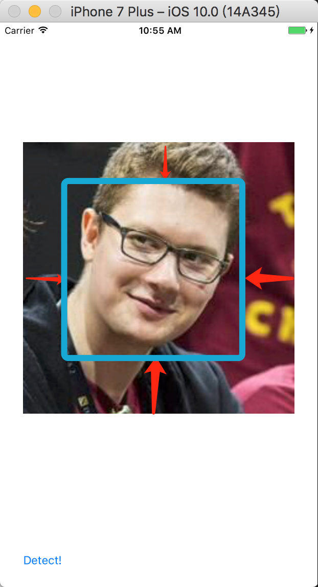

# UIImageView+FaceDetection
A simple UIImageView Extension

##Usage:

        imageView.doDetectionAndResetImage(MarkOrCut: false,inset: UIEdgeInsetsMake(50, 50, 50, 50))

###1.MarkOrCut: 
_If the picture has more than one faces, it will MARK ALL the faces or ONLY CUT the BIGGEST face._

           true  -> Only Mark Face with NO CUTTING
           false -> Only Cut Face with NO MARKING

###2.inset: the space between face and edges.
For example:

