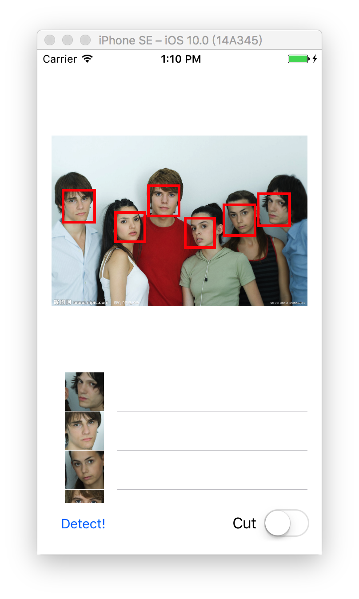

# UIImageView+FaceDetection
A simple UIImageView Extension with Face Detection/Cutting and Extraction

##Usage:

        imageView.doDetection(type:.Cut,inset: UIEdgeInsetsMake(5,5,5,5), detectOnly: false)

_Anyway, it will return an `Array<UIImage>` of face(s)_

###1.`type`: 
_If the picture has more than one faces, it will MARK ALL the faces or ONLY CUT the BIGGEST face._

           `.Mark`  -> Only Mark Face with NO CUTTING
           `.Cut` -> Only Cut Face with NO MARKING

###2.`inset`: the space between face and edges.

###3.`detectOnly`: 

        `true` -> only detect the face and return an `Array<UIImage>`
        _true will OVERRIDE type_

Some example screenshot:

